# Extract terms about covid-19 in tweets

This project aims to extracts terms about covid-19 in the corpus of tweets created by Echen : https://github.com/echen102/COVID-19-TweetIDs

This repository is based upon works of:
* **Juan Antonio LOSSIO-VENTURA** creator of [BioTex](https://github.com/sifrproject/biotex/tree/master)
* **Jacques Fize** who build a python wrapper of Biotext (see [his repository](https://gitlab.irstea.fr/jacques.fize/biotex_python) for more details)
* **Gaurav Shrivastava** who code FASTR algorithme in python. His script is in this repository

NB : **Due to the size of this corpus, biotex could not be launched on the full corpus. It has to be splitt in 30k tweets. Then results have to be merged and ranked**

## Pre-requisites :
Tweets have to be download (i.e. hydrated) from Echen repository. See steps belows :
1. Git pull echen directoru (https://github.com/echen102/COVID-19-TweetIDs)
2. Install twarc from pip and configure with a twitter account. Cf : https://github.com/DocNow/twarc
3. Launch echen hydrate script
4. Copy all hydrating tweets. There are zipped :
        find . -name '*.jsonl.gz' -exec cp -prv '{}' 'hydrating-and-extracting' ';'
5. Unzip all json.gz :
        gunzip hydrating-and-extracting/coronavirus-tweet
        
   
## Description of python scripts
* [Dataset Analysis](COVID-19-TweetIDs-dataset-analyse.py) : some stats computed on Echen corpus
* [Extractor](COVID-19-TweetIDs-extractor.py) : script extracting only tweets'contents (without RT) in order to share data without all twitter's verbose API 
* And a Pipeline for terms extraction using biotex :
    1. [preprocess](COVID-19-TweetIDs-preprocess.py) : cleaning up tweets and building corpus in the biotex syntaxe
    2. [biotex-wrapper](COVID-19-TweetsIDS_biotex_wrapper.py): An automatisation of biotex on 4 settings
    3. [merge biotex results](COVID-19-TweetIDS-merge-biotex-results.py): Due to the size of this corpus, biotex could not be launched on the full corpus. It has to be splitt in 30k tweets. Then results have to be merged and ranked
    
## Indexing and using Elasticsearch to explore corpus twitter API metadata
1. Installation of ELK and plugins :
    * Install ELK : logstash, elasticsearch and kibana
    * Install a plugin for logstash to geocode user location (plugin is for using API Rest):
        sudo /usr/share/logstash/bin/logstash-plugin install logstash-filter-rest
2. Start indexing in elastic with logstash :
    * sudo /usr/share/logstash/bin/logstash -f elasticsearch/logstash-config/json.conf
3. Import into kibana : dashbord from this repository
4. [Query](elasticsearch/analyse/Elasticquery.md) elasticsearch to extract tweets inside a specific spatio-temporal windows
5. [Build an adaptive TF-IDF on this extraction of tweets & analyse results](COVID-19-TweetIDS-ES-Analyse.py)
6. Match term extracted by our various methods with thesaurus like Agrovoc or MeSH using [SPARQL](elasticsearch/analyse/sparqlquery.md)
    
    Compute the percentage of terms extracting by TF / TF-IDF / H-TF-IDF **included** in the 4 thesuarus : Wordnet / Agrovoc / Mesh
    
    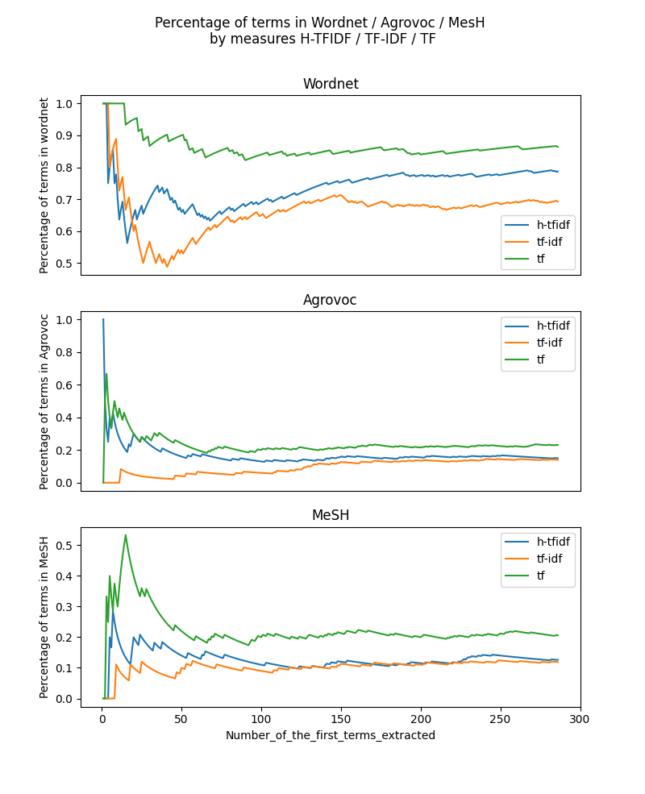
    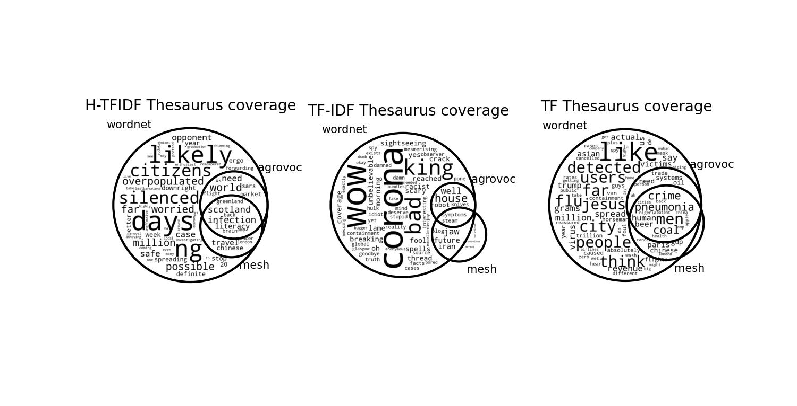
7. For the 3 measures first 100 terms : compares occurence of terms in states aggregated tweets
8. For the K most frequent terms in state aggregated tweets : compute % of the 3 measures coverage

    The aim is to compute % of overlapping between the K most frequent words using by state (i.e : concat all tweets by state) **with** N terms extracted by TF / TF-IDF / H-TF-IDF.
    TF and TF-IDF have been parameterized with Doc = 1 tweet and Corpus = UK.
    
    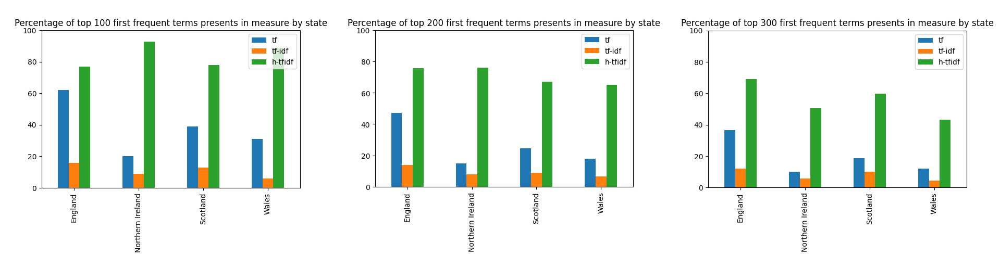
    
    H-TF-IDF works better than TF/TFIDF in general and in particular with small amount of tweets (Nothern Ireland)
9. Evaluation with different TF / TF-IDF settings : work on corpus and document 

    | H-TF-IDF  |  TF / TF-IDF UK | TF / TF-IDF by state |
    |:---|:---|:---|
    | Doc: All tweets aggregate by state  | Doc : 1 tweet  | Doc : 1 tweet  |
    | Corpus: UK  | Corpus: UK  | Corpus: for each state  |
    
    For the past evaluations, we use TF/TF-IDF with Doc = 1 tweet and Corpus = UK. During the presentation on text mining activities with the Executive Board of MOOD (2020-09-01), Bruno Martins suggest us to compare H-TF-IDF with TF / TF-IDF on corpus = state.
    
    Some results
    
    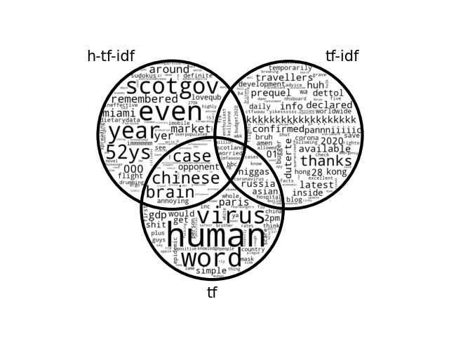
    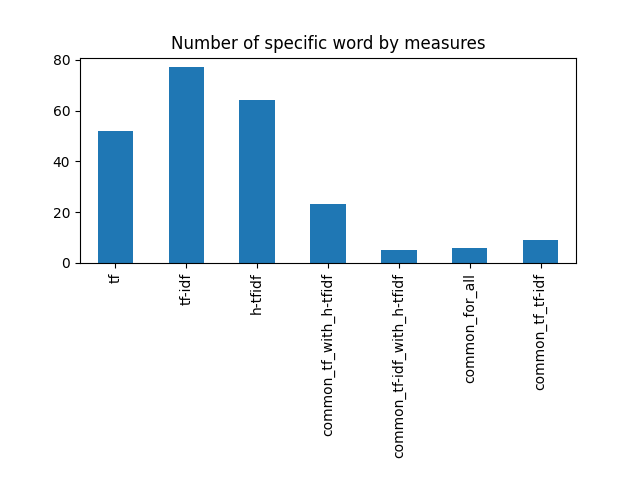
    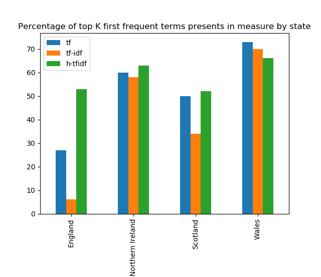
    
    Few comments: When focus on state, TF and TF-IDF have better overlap with K first terms most frequent in state, except for England (which as much more tweets).
    
    **So what we can say is H-TFIDF work better than TF/ TF-IDF for both on small (show in eval 8) and big (eval 9) amount of tweets** 
10. Evalutate the power of discrimination of H-TFIDF on space
    For each measure, count the number of word which are retrieve for only one state to show that H-TFIDF can retrieve terms used only in one place
    
    Some results
    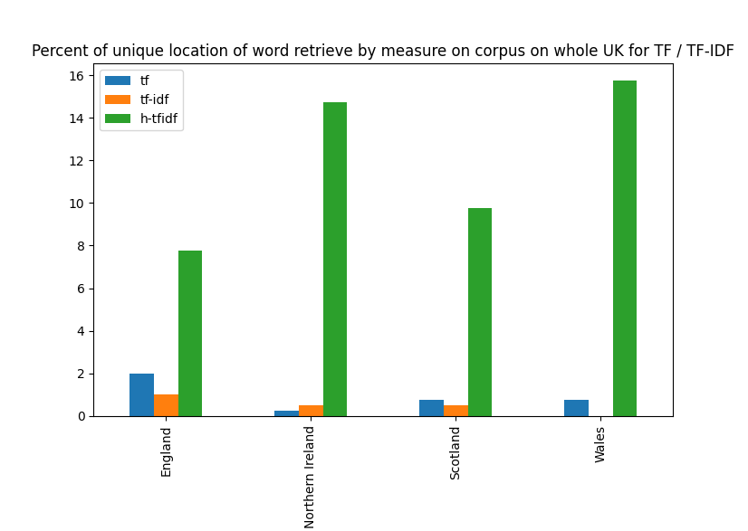
    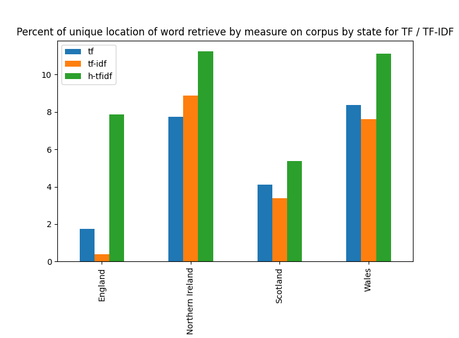
    
    Few comments :
    From matrix build in eval 8 and 9 (state coverage), we drop all duplicates, count word that have unique location and normalize on the length of extracted term by measure.
    
    **We see that H-TFIDF have more word with unique location that the others. It can then extract terms specific of a location**. 
    
    H-TFIDF works better thant TF/TF-IDF for state with big amount of tweets (England) 
11. Retrieve tweets corresponding at best ranked terms extracted by H-TF-IDF 
    
    a. What we want to evaluate is : Is H-TF-IDF retrieve terms from tweets from the specific state ? i.e. : if the world "w" is extracted by H-TF-IDF for state "s", is the w in also other state ?
    To achieve that, we query elastic search to get all tweets (and their location) containing terms extracted from H-TF-IDF and TF-IDF (corpus = state). Then compute the ratio of Sum of count of tweet with state associated with the term extracted / sum of count of all Tweet.
    
    Some results :
    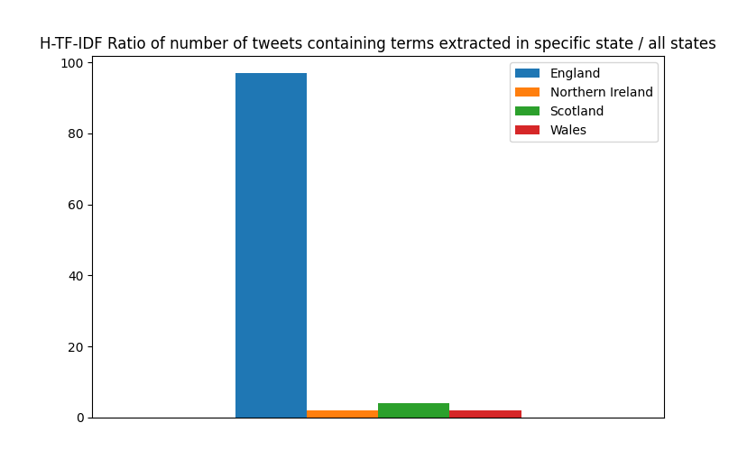
    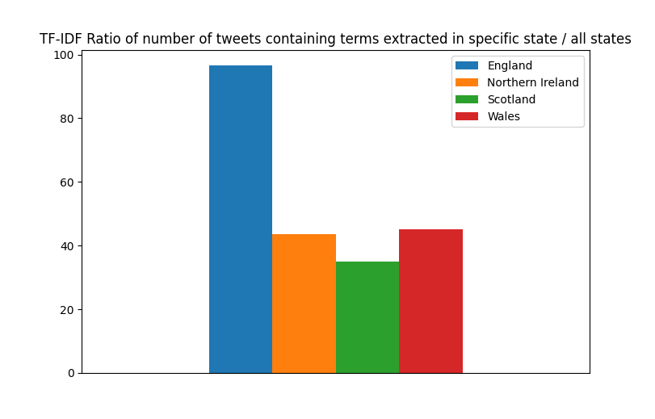
    
    Few comments:
    These figures doesn't show the discriminance power because of terms very frequent that are common used in England. For example  the term "worried" best H-TF-IDF of Nothern Ireland is in lot of tweets from England as well.
    This over frequently term affect to much theses barchart.
    
    b. Compute the mean of nb of states for each term 
    
    For each state, compute the mean of number of states that a tweet containing terms of measure have been sent.
    
    Some results:
    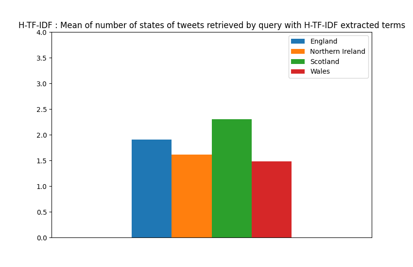
    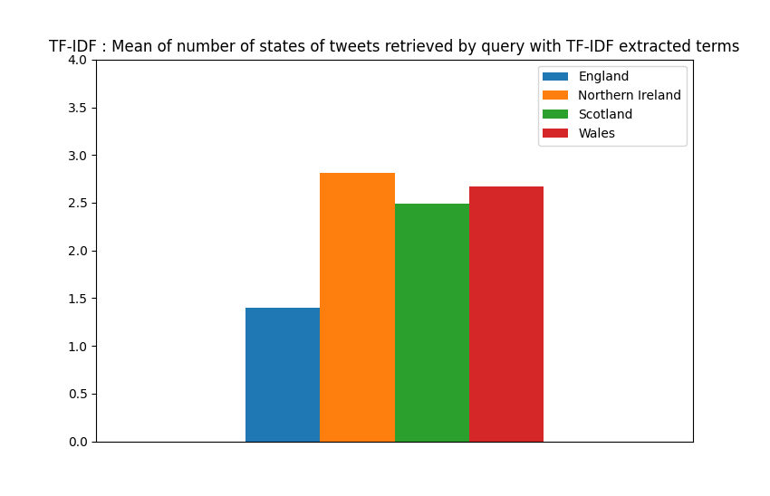
    
    Few comments:
    
    Tweet containing terms extracted from H-TF-IDF are from less different states that TF-IDF (exept for England) that show H-TF-IDF have a better space discriminance.  
    
    What we can also say is H-TF-IDF could be very effective when we compare different area with large disparities int the number of tweets (For example : England with Nothern Ireland). This could be very usefull for analyse European countries.
    
12. Create a choropleth maps on count of tweets by UK states

    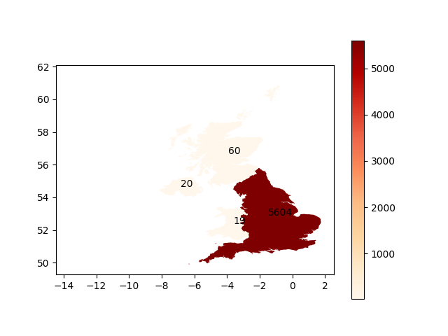