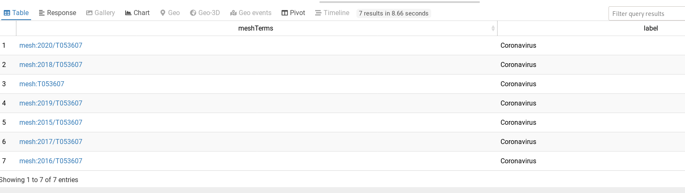

# SPARQL queries explained
After etracting terms from the tweets using various methodes (H-TFIDF, TF-IDF, TF), we seek to know how many of them are in controlled vocabulary (i.e Thesaurus) like Agrovoc and MeSH.
## Agrovoc
**endpoint**: http://agrovoc.uniroma2.it/sparql

### query
```
PREFIX skos: <http://www.w3.org/2004/02/skos/core#>
PREFIX skosxl: <http://www.w3.org/2008/05/skos-xl#>

select ?myterm ?labelAgro 
WHERE {
    ?myterm skosxl:literalForm ?labelAgro.
    FILTER(lang(?labelAgro) = "en").
    filter(REGEX(?labelAgro, "^coronavirus(s)*$", 'i'))
}
```
Result of this query (but for the term "symptom" instead of "coronavirus" becaut it's in Agrovoc) on Agrovoc Website : http://agrovoc.uniroma2.it/sparql
 
### explanation
We want to retrieve 2 variables that we names myterm and labelAgro :
* labelAgro is a LiteralFrom predicat which is enlish and match our term. Here, for the example, our term is "cornavirus". The regex add an optional "s" at this end of term because, in Agrovoc, concept in english are in their plural form (unlike concept in French)
* myterm is concept which as a LiteralForm predicat that match with these 2 requirements explained above (label is English and matching the regexs)
## MeSH :
**endpoint**: https://id.nlm.nih.gov/mesh/

### query
```
PREFIX rdf: <http://www.w3.org/1999/02/22-rdf-syntax-ns#>
PREFIX rdfs: <http://www.w3.org/2000/01/rdf-schema#>
PREFIX xsd: <http://www.w3.org/2001/XMLSchema#>
PREFIX owl: <http://www.w3.org/2002/07/owl#>
PREFIX meshv: <http://id.nlm.nih.gov/mesh/vocab#>
PREFIX mesh: <http://id.nlm.nih.gov/mesh/>
PREFIX mesh2020: <http://id.nlm.nih.gov/mesh/2020/>
PREFIX mesh2019: <http://id.nlm.nih.gov/mesh/2019/>
PREFIX mesh2018: <http://id.nlm.nih.gov/mesh/2018/>

SELECT ?meshTerms ?label
WHERE { 
  ?meshTerms a meshv:Term .
  ?meshTerms meshv:prefLabel ?label .
  FILTER(lang(?label) = "en").
  filter(REGEX(?label, "^coronavirus*$", 'i'))
  
}
```
Results of this query from MeSH website : https://id.nlm.nih.gov/mesh/query

### explanation
We want to retrieve 4 variables:
* ?meshTerms: Terms in mesh that have a prefLabel matching 2 conditions (English and coronavirus)
* ?label : The mesh term pref label that match 2 conditions (in filter)

### cURL
This query could be retrieve using curl. It's very useful for debugging.
**Be careful** cURL (with default option) doesn't follow redirection. However a lot of SPARQL Endpoint redirect to HTTPS. Be sure to give cURL an endpoint address without redirect (HTTP 301 Moved Permanently)
#### Query
```
curl -G https://id.nlm.nih.gov/mesh/sparql --data-urlencode query='
PREFIX rdf: <http://www.w3.org/1999/02/22-rdf-syntax-ns#>PREFIX rdfs: <http://www.w3.org/2000/01/rdf-schema#>PREFIX xsd: <http://www.w3.org/2001/XMLSchema#>PREFIX owl: <http://www.w3.org/2002/07/owl#>PREFIX meshv: <http://id.nlm.nih.gov/mesh/vocab#>PREFIX mesh: <http://id.nlm.nih.gov/mesh/>PREFIX mesh2020: <http://id.nlm.nih.gov/mesh/2020/>PREFIX mesh2019: <http://id.nlm.nih.gov/mesh/2019/>PREFIX mesh2018: <http://id.nlm.nih.gov/mesh/2018/>SELECT ?meshTerms ?labelWHERE {   ?meshTerms a meshv:Term .  ?meshTerms meshv:prefLabel ?label .  FILTER(lang(?label) = "en").  filter(REGEX(?label, "^coronavirus$", "i"))}
'
```
Which retrieve an XML with the correct result.
Using cURL help to define a good query for debugging specially when SPARQL endpoint redirect to HTTPS (wireshark/tcpdump could not give us opportunity to go further in debugging). What's more, the python librairie used for sparql, sparql-client, doesn't give much information on this error, just telling which HTTP code error you raised.
For example, it helps me to know that the condition "form" doesn't work well with cURL neither with python's sparql-client package.

## Building Query
Often each thesaurus has their home made web interface to build a query. It's very useful (they show a list of pre-build queries) 
* [agrovoc](http://agrovoc.uniroma2.it/sparql)
* [mesh](https://id.nlm.nih.gov/mesh/query)

But it hides things sometimes. For example, [mesh](https://id.nlm.nih.gov/mesh/query) hides the correct endpoint.
So you may want to use another web interface. I suggest [Triply](http://yasgui.triply.cc/) as it has a lot of reprentation of data (HTML / Table / Chart / Geo / Timeline).

